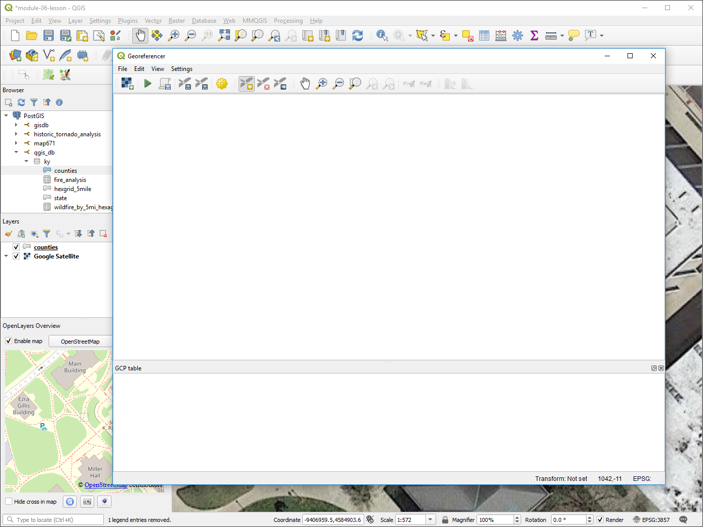
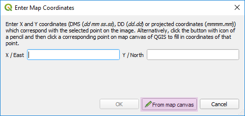
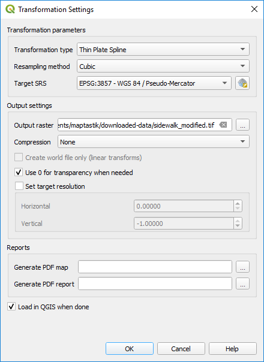
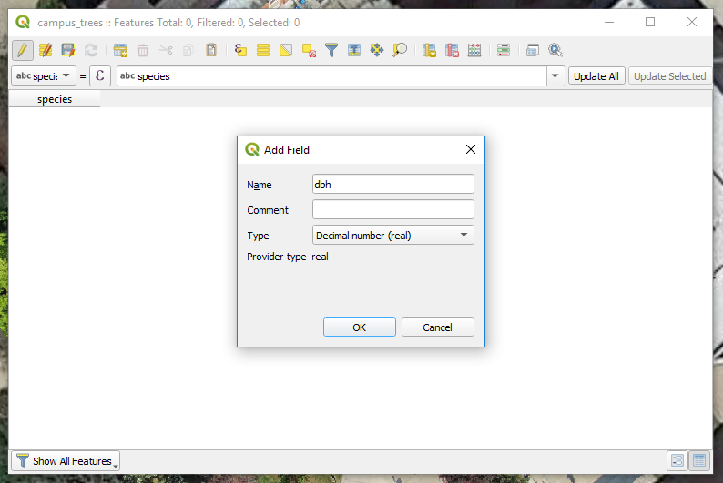

# Lesson 06: Georeferencing imagery and digitizing data

## Table of Contents

<!-- TOC depthFrom:1 depthTo:6 withLinks:1 updateOnSave:1 orderedList:0 -->

- [Lesson 06: Georeferencing imagery and digitizing data](#lesson-06-georeferencing-imagery-and-digitizing-data)
	- [Table of Contents](#table-of-contents)
	- [Overview](#overview)
	- [Lesson data files](#lesson-data-files)
	- [Introduction](#introduction)
	- [GDAL and OGR](#gdal-and-ogr)
	- [Georeferencing](#georeferencing)
		- [Adding a base map](#adding-a-base-map)
		- [Using Tile Server (XYZ)](#using-tile-server-xyz)
		- [Using the GDAL Georeferencer](#using-the-gdal-georeferencer)
	- [Digitizing Data](#digitizing-data)
		- [Digitizing data in Open Street Map](#digitizing-data-in-open-street-map)
		- [Digitizing data using QGIS](#digitizing-data-using-qgis)
		- [Advanced digitizing in QGIS](#advanced-digitizing-in-qgis)
		- [Finishing a digitizing session](#finishing-a-digitizing-session)
	- [Addendum: Georeferencing The Rumsey Collection](#addendum-georeferencing-the-rumsey-collection)

<!-- /TOC -->

## Overview

This module will introduce the process of georeferencing an image (either aerial, satellite, or a static image) to align it to real-world locations. A georeferenced image can be used as a raster layer in our GIS. The module concludes by exploring techniques for creating and editing new vector geometries using georeferenced imagery.

The module introduces you to two significant online mapping resources:

* [OpenStreetMap](http://www.openstreetmap.org) for displaying base maps and digitizing new features on a shared map.
* [David Rumsey Historical Map Collection](http://www.davidrumsey.com/home) is a map library where a visitor can georeference historical maps. We discuss this in the addendum.

After this lesson, you'll be able to:

* georeference an image
* create new vector data

## Lesson data files

The images were created by University of Kentucky Geography department (balloon photography), and the vector file was provided by UK's Facilities Management Information Services. The data is located on Canvas.

**CampusSidewalkLesson.zip**

* sidewalk.jpg (not georeferenced)
* sidewalk-geo.tif (georeferenced)
* UK_SideWalks.shp

## Introduction

In previous modules, we have been using data from other sources, but the awesome capacity of being a map maker is making your data. To that end, we'll be georeferencing a photograph from a balloon camera image, creating a GIS raster layer from this image, and then digitizing new vector data from this layer. This workflow of creating new vector data from aerial or remotely sensed imagery has long generated much of data we use in our maps today.

## GDAL and OGR

The [Geospatial Data Abstraction Library (GDAL)](http://www.gdal.org/) is an open source library for reading and writing raster format geospatial data developed by the [Open Source Geospatial Foundation (OSGeo)](http://www.osgeo.org/). As we know, OSGeo is behind the development of QGIS. The vector corollary of GDAL is OGR, which interestingly enough doesn't stand for anything. It used to stand for _OpenGIS Simple Features Reference Implementation_, but it's no longer compliant with that data standard. So the name is just OGR, typically pronounced "ogre," as in a flesh-eating giant. You'll see these two libraries referenced in the names of QGIS plugins and geospatial tools across the field. It is the use of these two libraries that allow geospatial programs to read and write in multiple geospatial formats.

## Georeferencing

Georeferencing adds real-world coordinates to raster layers, such as scanned maps, remotely sensed imagery, and aerial photography. This lesson will georeference a photo of University of Kentucky's central campus made from tethered ballon. The process has a few essential considerations:

* Locating control points in the image that correspond to know locations.
* The transformation method that determines how much we alter the image to fit the control points to these known locations.
* Selecting the right coordinate reference system can help minimize the alteration of the image.

The raster layer that is to be georeferenced must have observable points to which we can either explicitly add X,Y coordinates or find the same location on a spatial layer, such as Google Maps or own spatial data. These are called ground control points (GCPSs) and the more defined, the better the outcome.

The transformation determines how much we can alter the original raster during georeferencing. Some transformation will only scale or rotate the raster (first order polynomial) while others will do sophisticated warping across the raster (Thin plate spline). The most popular and one the fastest transformations is the second order Polynomial algorithm, which allows for some warping but not as much as the Thin plate spline. In this lesson and lab we use the Thin plate spline transformation to georeference a low altitude aerial photograph and an old map.

If we are warping our raster, we need to pay attention to the method used to resample pixels. If our original raster layer was a scanned map of land cover with discrete classes (e.g., dark green represents evergreen forest, blue represents water, etc...) we would select the "Nearest Neighbor" resampling method. If our raster was a photograph showing a continuous phenomena, we would select the "Cubic" resampling method.

Selecting the right coordinate reference system depends on your raster layer you want to georeference. If the raster is an aerial photograph, it often doesn't have a CRS. The source spatial layer used for georeferencing will have a CRS, which the aerial photograph will inherit. If you are georeferencing a scanned map, then you should investigate what projection the map is using. You can then set up a georeferencing session using the map's CRS.

### Adding a base map

We are going to need some sort of general reference map or *base map* in order to georeference an image. Fortunately, QGIS is able to load several pre-made base maps and in a variety of formats. If we look at the we can several data formats that a base map might be provided in. We'll work more closely with **XYZ Tiles** in this module, but it is not unusual to encounter base maps that should be accessed via **ArcGIS MapServer** or **WMS/WMTS**.

Taking a closer look at the **Browser Panel**, you should see an option for **XYZ Tiles**. By default it includes the *OpenStreetMap* default Mapnik base map.

   
*OpenStreetMap loaded from XYZ Tiles*

#### Using XYZ Tiles

We are not limited to just the OpenStreetMap base map. We can add XYZ tiles we've made ourselves or, more likely, XYZ tiles that are publicly available. Tile Server (XYZ) is found in the **Browser Panel**, right-click **XYZ Tiles** and enter a URL for a raster tile set and then a good name to remember this base map.

Below are some common base maps:

* OpenStreetMap: http://a.tile.openstreetmap.org/{z}/{x}/{y}.png

Find many more base maps at ESRI: http://server.arcgisonline.com/ArcGIS/rest/services. You'll need to add /tile/{z}/{y}/{x} to use them in QGIS:

* National Geographic style base map for nice style: http://server.arcgisonline.com/arcgis/rest/services/NatGeo_World_Map/MapServer/tile/{z}/{y}/{x}
* World aerial photography similar to Google Satellite: http://server.arcgisonline.com/ArcGIS/rest/services/World_Imagery/MapServer/tile/{z}/{y}/{x}

A good source of free tile sets can be found in the [Leaflet-providers plugin](https://leaflet-extras.github.io/leaflet-providers/preview/) (look for the URL in "L.tileLayer" variable). Copy and past that URL and you should have a good collection of base maps.

For best results, you'll need to use the CRS of the base map service, which is EPSG: 3857. World projections will not likely work or will be very slow. Local CRSs based on conformal projections seem to work okay.

#### Bulk addition of several base maps

It can be time consuming to try and find the right base map provider, figure out the URL template and get it setup in QGIS. Fortunately, a Swedish GIS developer, Klas Karlsson, shared a clever little script to add several base maps at once.

Although you can do quite a bit with QGIS by pointing and clicking with your mouse, you can also write scripts using the Python language to create new tools and automate tasks. In fact, all QGIS's plugins use Python to extend QGIS's capabilities. A Swedish GIS developer, Klas Karlsson, shared a clever little script to add several base maps at once.

    
*Klas Karlsson shares his script to bulk add base maps*

While Klas's script is not a plugin, it takes advantage of Python's ability to quickly automate repetitive tasks. Essentially, this script uses Python to go through a list of base maps and carry out the steps described earlier for adding a new base map to **XYZ Tiles** for each base map in that list. It does all this all in a matter of seconds!

We'll use that script, which is in the root of your Module 06 repository as *qgis_basemap.py* to give us a nice library of base maps to choose from for this and future lessons. Let's walk through how to use Klas's script to add several XYZ base maps to QGIS.

1. In Atom, open up [qgis_basemaps.py](qgis_basemaps.py).
2. Copy the entire contents of the file.
3. In QGIS navigate to **Menu Bar > Plugins > Python Console**

4. Paste the script into the Python Console command bar. At this point, most of the script should start running. You may need to wait a few seconds for it to complete.
5. The last line of the script `iface.reloadConnections()`, should appear in the command bar. Press **Enter**.

I encourage you take a few minutes to take a look at some of the base maps that have been added to your *XYZ Tiles* data sources. You'll find a nice variety of base maps with particular foci,
including more standard road maps like *Esri Standard* 

more artistic maps like *Stamen Watercolor*   

and aerial imagery maps like *Google Satellite*.

### Using Georeferencer GDAL

Please enable [Georeferencer GDAL](https://docs.qgis.org/testing/en/docs/user_manual/plugins/plugins_georeferencer.html) in your Plugin Manager. Georeferencer GDAL uses the GDAL library to facilitate the manipulation of an image to fit within a specified coordinate system and adds that geospatial information to the image, creating a **GeoTIFF** raster layer.

   
*Activate Georeferencer GDAL*

You can see the functional difference between a GeoTIFF and an unreferenced image by adding the provided files, *sidewalk.jpg* and *sidewalk-geo.tif* to a new project in QGIS using the **Add Raster Layer** option and then add the *Google Satellite* layer from your list of **XYZ Tiles**. If you zoom to the *sidewalk-geo.tiff* image, you'll find it lines itself up pretty well with the sidewalk outside of Patterson Office Tower on the University of Kentucky's campus.

   
*Image of the sidewalk GeoTIFF placed over Google imagery*

The *sidewalk.jpg* image is an unreferenced copy of the same image and it contains no coordinate information with which the GIS can place its size or location. Therefore, when loaded into QGIS, it appears floating around off the coast of Africa. Sidetone: the spot where the *sidewalk.jpg* appears is the point where the Equator crosses the Prime Meridian at latitude 0 degrees and longitude 0 degrees. The nickname for this spot is [Null Island](https://blogs.loc.gov/maps/2016/04/the-geographical-oddity-of-null-island/), and some maps even show a fictional island on that location.  In general, if your data is showing up at Null Island, it's an indication that there's something is terribly wrong, unless of course you are mapping 0,0.

Go ahead and remove *sidewalk.jpg* from the map. We'll bring it back in through the GDAL Georeferencer tool to align it within a given coordinate system.

It might also help to add a spatial layer the covers your area of interest. Consider using the **Filter...** and  **Zoom to Layer** to isolate Fayette County, Kentucky for this lesson.

With the Georeferencer GDAL enabled in your plugin manager, you can access it by clicking **Raster > Georeferencer**. Click on the **Open Raster** icon  in the upper left corner of the **Georeferencer** window and then browse to select the *sidewalk.jpg* file as the raster image to open.

    
*Starting the Georeferencer*

Before we start georeferencing the image, we need to specify a CRS for this image. Georeferencing allows you to take an image in one coordinate system and after selecting a number of reference points, transform it to another coordinate system. In the case of an image of a map, you would supply the coordinate system the map was made in, or if you didn't know what it was, you'd make an educated guess based on the location depicted on the map and the time period in which it was made. We're trying to georeference a photograph taken with a digital camera suspended from a 5.5' weather balloon; the image was never projected. We're going to select CRS 3857, WGS84/Pseudo Mercator, the projection of the Google Satellite image we're referencing it against. To set the CRS navigate to **Settings > Transformation Settings...**. Here you'll change the *Target SRS* option to EPSG: 3857.   

    
*Set the **Target CRS** to EPSG: 3857*

Once you've got the image loaded into Georeferencer, this is what you should see.

   
*Loading the sidewalk.jpg into the Georeferencer*

We're going to add ground control points, GCPs, that match the same point in our non-georeferenced image with the base map to which we're referencing. We'll do this by clicking the **Add Point** icon  and then clicking on a recognizable point in the image. In the case of the provided image, the corners of the distinctive sidewalk paths are your best bet.

Once you've created your point, a small pop-up window will ask you to name the matching coordinates in the base map. This would work if we were georeferencing to something that had a coordinate grid on it, but for us it'll be easier to make the selection from the map canvas. Clicking on the **Select from map canvas** icon will open the main QGIS browser window.

    
*Enter Map Coordinates from map canvas*

Locate the same point you identified previously on the Google Satellite image base map and click to set the point. You'll be prompted to accept the point. If you feel happy with it, click **OK**. Otherwise, I'd recommend hitting **Cancel** and trying again.

     
*Click OK when coordinates values are populated*

Keep selecting reference points until you have at least 5 of them distributed across the page. Remember, more points makes the process more accurate. If you need to delete a point or move one, you can select the **Move Point** icon  or **Delete Point** icon , respectively, to facilitate that. If you lose your arrow while panning and zooming, you'll need to click the **Select from map canvas** button again. It's probably hiding under the main QGIS window. You should also make a Spatial Bookmark for the area of interest.

    
*Control points in Georeferencer*

Before completing the georeferencing process, let's open up **Transformation Settings** and make some adjustments:

- Transformation type: Thin Plate Spline
- Resampling method: Cubic
- Output raster: Set this to an appropriate location and give your output image a name that indicates that it has been modified or georeferenced
- Use 0 for transparency when needed: checked
- Load in QGIS when done: checked

    
*Transformation settings*

The output is shown below and pretty close!

*Comparison of georeferenced geotiff with Google Satellite imagery*

If you're displeased with the outcome, you can continue adding points and refine your georeferencing with Georeferencer. When you close the Georeferencer tool, you'll be asked to save your GCP references, these are your reference points. Save these in the same place as the image they refer to. You can reload this image and experiment with the tool's parameters without having to add ground control points.

## Digitizing Data

Now that we have our imagery georeferenced, what can we do with it? One important use is to trace and create new vector data layers. This process is known as digitizing. As we create new points, lines, and polygons we can add attributes that could be used to symbolize our features for finished mapping.

As recent as 20 years ago, digitizing consisted of a large specialized table that could record the location of cursor (aka puck) clicks. Poster-sized maps would be secured to this table and you would trace lines and manually click to add a location. Your head was down tracing the large paper that couldn't be zoomed. With the inexpensive cost of scanners and hard disk storage, we today use monitors and are "heads up" while adding vector features over a map image on screen.

### Digitizing data in Open Street Map

We're going to take a quick digital field trip to [OpenStreetMap](https://www.openstreetmap.org) (a.k.a OSM). OpenStreetMap  is the world's largest crowdsourced, open source, mapping project. Think of it as the Wikipedia of Maps. It's also a great place to get experience in digitizing vector data while actually contributing to a map dataset that you're probably using everyday without knowing it.

Once you're on the OpenStreetMap page, you'll need to create a user account. Once you're logged in, you can edit the map in your browser. Select the **Edit** dropdown then **Edit with iD**. If this is your first time editing, please select and work the short **Walkthrough demo**. It will help explain the process of creating/editing features and the relative advantages of digitizing with point, line, and polygon features. You'll notice that in addition to creating the actual vector features on the map, a large part of creating data is adding the attribute information.

*OpenStreetMap iD Editor walkthrough initial screen*

Once you've completed the walkthrough, choose a part of the world that you're familiar with and start editing. Use [Tagfinder](http://tagfinder.herokuapp.com/) to look up the meaning of tags, or to verify which tag to use if you aren't certain. (Note: iD Editor doesn't appear to contain all the tags available in OSM. If you can't find the exact tag you want, use a slightly more general tag instead. For instance, you could use "shop" instead of "bike shop," if bike shop were unavailable.) We're going to be using downloaded OSM data in the next module, so this is your chance to get familiar with it in advance.

One thing to know about OpenStreetMap: All of your edits must be real. Adding false information to the map is known as "map vandalism" and is one of the few offenses for which users can be banned from the site. The data generated by OSM is used by thousands of mobile apps and websites, don't vandalize the map.

### Digitizing data using QGIS

Back in QGIS, we're going to use what we learned about digitizing in OSM to digitize trees from our georeferenced image. To create a new geometry layer, from the top menu bar click **Layer > Create Layer > New Temporary Scratch Layer**.

   
*Create new scratch layer from QGIS menu*

We could create a number of new feature layers, e.g., Shapefile, SpatiaLite layer, etc. In our workflow, we'll create an empty temporary layer, add features with attributes, and when we're finished we will import the layer into a SpatiaLite database or export to a GeoJSON. The temporary layer gives us a little more flexibility, but it only exists in the current session of QGIS; when you close the program, the layers will be deleted. Let's create our first layer:

   
*Specify new layer properties*

You'll need first to decide whether your new layer will be point, line or polygon data (or multipart). For this layer, we'll use **Point**. Next, we need to set the CRS, which will be EPSG: 3857. Finally, give it a meaningful name,  "campus_trees" or similar.

Now we have the opportunity to add fields to our attribute layer. Right-click the newly created layer to access **Open Attribute Table > Add new field**:

   
*Add new field in attribute table*

We'll add a field called "species". For **Type**, select *Text, unlimited length (text)*. Click **OK**:

   
*Add a new attribute, "species"*

We'll add another field called "dbh" (DBH or "diameter at breast height" is a standard measurement for tree mapping). For **Type**, select *Decimal number (real)*. Add it to your table and click **Ok**:

   
*Add a new attribute, "dbh"*

Let's add our first feature. In the Editing toolbar (below the main toolbar), or in the QGIS menu **Edit**, select **Add Point Feature** . This will turn your mouse pointer into a crosshair and allow you to add points where ever you click on the map. Click on one of the trees in the area that we georeferenced. A small menu box will popup listing the fields from our attribute table. Fill it in with a tree species and a value for the DBH. (We're just practicing the tool right now, so it doesn't matter what data you enter or for which tree, so long as the data type you enter matches the data type for the field.)

    
*Adding attributes after placing a point*

Keep adding trees to the layer until you have 6 points. When you've finished adding your trees, click the **Save Layer Edits** icon  in the Editing toolbar and then toggle off editing by right-clicking on the layer again and selecting **Toggle Editing**. You can delete or move points by turning on editing and using the **Delete Selected**  and **Move Vertex**  tools, respectively, located in the Editing toolbar. Always remember to save your edits or they will be discarded.

### Advanced digitizing in QGIS

Do the same thing again to add line and polygon layers to digitize the paths and greenspace areas. You will need to create a new layer for each data type. You can edit multiple layers simultaneously by selecting the layer you wish to edit. The Editing toolbar options will change depending on the geometry type you're editing. The explanation of when to use lines versus polygons or points that was given in the OSM walkthrough, holds true here as well.

When you digitize lines, you select **Add Line Feature** . For polygons you select **Add Polygon Feature** . To start either a point or polygon feature, use left-clicks to add vertices and a right-click to end digitizing of that feature. The **Move Vertex** tool will allow you to move individual vertices to reshape your feature.

As digitize multiple layers, you'll soon discover that you want to have features align perfectly with other layers. We calls this "Snapping" which controls how vertices are placed when we digitize. It is not enabled by default, but we can access it in QGIS's menu **Project > Snapping Options**:

Controlling how vertices are placed will greatly minimize clean-up edits down the road; as they say, do it right the first time! The idea behind snapping is make features align with other features, e.g., with side walks, have line endpoints end on the segments of intersecting sidewalks. Or, having greenspace polygons edge match sidewalk polygons.

There is no simple solution since the need for snapping varies. Let's enable snapping and experiment with its options:

    
*Enabling Snapping options*

The general options to configure include:

* **Layer Selection** controls if you snap to just currently select layer features are all visible features. This is how you would snap between layers. The "Advanced" setting will tightly control how you snap between layers
* **Snap to** controls if you snap to just a vertex, the segment in-between vertices, or both, or disable snapping.
* **Tolernece** defines how close you need to be to a feature to enable snapping; the larger the number, the easier it is to snap. If it's too large, you won't be able add new vertices in empty space.

OK, just experiment with snapping and adding features. Digitizing takes contact experience with the tools to 'get a feel' for how it works. With our temporary layers, we can always create a few layers and practice before we make our best data.

### Finishing a digitizing session

When are done digitizing your temporary layers, **Toggle Editing** off, and save edits. You will need to either import into a spatial database or **Export > Save Features As...** to a GeoJSON or Shapefile. Temporary layers will be lost if you close QGIS before you save the temporary layers to permanent layers (though a plugin is available that automatically saves temporary layers).

You can always save and continuing editing layers as GeoJSON or in a database. GeoJSON layers cannot be edited in QGIS on Linux OS.

## Addendum: Georeferencing The Rumsey Collection

We're going to go on a digital field trip to one of the world's most well-known map collections, the [David Rumsey Historical Map Collection](http://www.davidrumsey.com/home). The Rumsey Collection contains over 150,000 maps with over 61,000 of those available online. The collection is expansive; it contains four centuries worth of rare maps from all over the world. It's a little slice of cartophile heaven. Go ahead and take a brief stroll through the collection.

The Rumsey Collection is massive and it includes huge amounts of information that could be useful to people studying a broad range of topics, everything from toponymy to climate change. However, much of this imagery is saved in a raster format without encoded spatial reference information. Therefore the information within these maps is not immediately accessible within a GIS.

To make these maps and their content available for digital use, they need to be georeferenced. You can imagine with the number of maps that the Rumsey Collection contains that that would take a lot of time and money to do. So the Rumsey Collection has launched a project called Georeferencer to crowdsource the georeferencing of the collection. To get a feel for the georeferencing process, we're going to contribute to the project and georeference a few maps for them. Go ahead and open [Georeferencer](http://www.davidrumsey.com/view/georeferencer). There's a brief introduction video that explains how to use the tool before you're let loose on the maps. Georeference 2 to 3 maps for practice before moving on to the next portion of the module in QGIS.

Tips for improving your georeferencing results:

* 3 points is an absolute minimum, more is better
* Spreading the points evenly across the map helps
* Zoom way in when placing your points, accuracy matters
