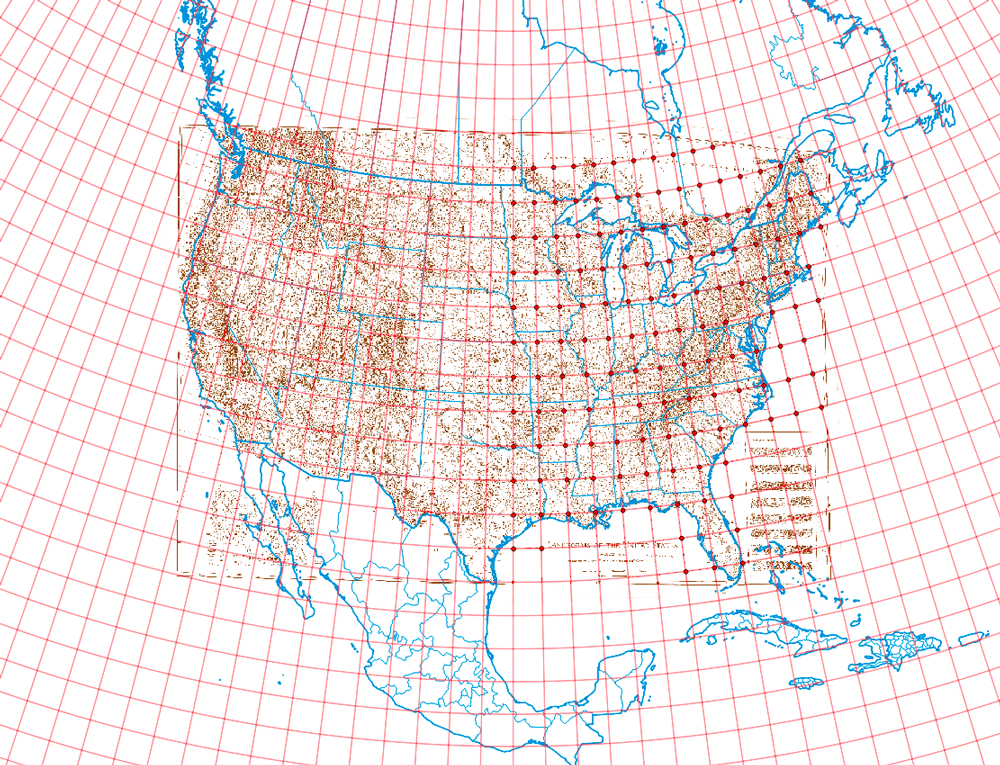

# Module 06 Lab Assignment

## Table of contents

<!-- TOC depthFrom:1 depthTo:6 withLinks:1 updateOnSave:1 orderedList:0 -->

- [Module 06 Lab Assignment](#module-05-lab-assignment)
	- [Table of contents](#table-of-contents)
	- [Part I: Work through lesson document (2 pts)](#part-i-work-through-lesson-document-2-pts)
	- [Part II: Craggy Cartographers commemorative map (8 pts)](#part-ii-craggy-cartographers-commemorative-map-8-pts)
		- [Data files](#data-files)
		- [Required specifications of the deliverable](#required-specifications-of-the-deliverable)
	- [Suggestions and Tips](#suggestions-and-tips)

<!-- /TOC -->

## Part I: Work through lesson document (2 pts)

Work through the lesson where you practice georeferencing a remotely sensed image (by tethered balloon) and digitizing vector features from that image. This important smaller step will help tackle a much larger project in Part II. Make a simple web page layout that contains:

>1. A map showing the georeferenced image of campus sidewalks. The map needs only a scale bar and a title.
>2. The web page should provide a link to a GeoJSON that contains three digitized features, e.g., three trees. Think about the different methods you could encode a feature. If you are mapping trees, do you place a point for the center of the tree or make a polygon covering the trees' trunks or even canopy? There is no right answer but you should reflect on your cartographic or analysis goals. The GeoJSON attributes need only to contain the type of feature mapped, e.g., "tree" or "bench" or "sidewalk." The GeoJSON must be in the EPSG: 4326 coordinate reference system.

Use the template web page located in the *lesson-map* folder. Commit the changes and push the repository when you are finished.

## Part II: Craggy Cartographers commemorative trail map (8 pts)

An organization called Craggy Cartographers, a hiking club for old mappers, has commissioned you to make a special commemorative map using a classic map from [Erwin Raisz](http://www.raiszmaps.com/). They need a map showing either the Appalachian Trail or Pacific Crest Trail in at least three contiguous states. You can do more states, but this is a particularly tricky assignment. You will need to georeference the Raisz map before you can use it as a base map.

The requirements of the map are listed below. All the tasks required to fulfill this assignment are documented within this and previous Modules.

### Data files

The following data was collected from a variety of sources. Find _TrailMapData.zip_ on Canvas in the Lab Assignment section.

* Raisz_Landforms1957.tif (Copyright [Erwin Raisz](http://www.raiszmaps.com) and not to be distributed outside of class)
* AppalachiaTrail.shp ([Appalachian Trail Conservancy](http://www.appalachiantrail.org/home/explore-the-trail/gis-data))
* PacificCrestTrail.shp ([USDA Forest Service](https://www.fs.usda.gov/detail/pct/home/?cid=stelprdb5322473))
* ne_10m_graticules_1.shp ([Natural Earth](http://www.naturalearthdata.com))

### Required specifications of the deliverable

1) The final map must fulfill the following requirements:

>* The Raisz must be georeferenced and function as your base map
>* The map must show at least three contiguous states
>* The map must contain US state outlines (e.g. us_state_500k from previous labs)
>* The map must contain a portion of either the Appalachian Trail or Pacific Crest Trail
>* The coordinate reference system of the map must be North America Albers Equal Area Conic (EPSG: 102008) and you can rotate the map canvas as needed
>* Map must have a meaningful title and appropriate legend
>* Export map as JPG (JPEG format does well compress highly variable imagery like photographs) that is no large the 50 MB file size.

2) The client has requested a web page that shows the static map(s) with link to a higher resolution version. This web page map must meet the following requirements:

>* Map needs to be in two resolutions: 1) width of 1,200 px and 2) width of 8,000 px
>* A link must be available to access the higher resolution version.
>* The web page must have must have a meaningful title (both in the header title element and in the h1 element) and metadata about the author, data source, and brief description of purpose.
>* Map must include metadata information including the source and the projection information
>* Contact information in footer must be tuned to you, the author.

3) Super Challenge: Since this a cartographic exercise about beautiful places and maps, fill out your web page with design elements that promote the theme. Add photos of the mountains and landmarks that the trail follows.

4) Extra Super Challenge: Use QGIS to digitize features found on Raisz's map. For example make polygons for water features, lines for streams, or points for mountains. Use layer transparencies to build up effects for your map, such as showing large bodies of water.

5) Mega Super Extra Challenge: Post a GoPro video of you hiking a trial with some Craggy Cartographers.

## Suggestions and Tips

The final map could look like this, but you are welcome to add your own design explorations. Remember, you need to only show three contiguous states. This map shows the entire Appalachian Trail:

   
*Example output from lab 06, the Appalachian Trail, and blue water*

* Note the blue water? Make your QGIS project properties have a blue background. Add the state layer and make it have a no pen outline and a white polygon fill. Then play with layer order and the blending mode of your raster layer to achieve the desired effect.

* To help with placing control points during georeferencing, layout your graticule (preferably in two-degree increments). Study Raisz's map to find his use of a graticule. Also, state outlines can help locate good control points.

   
*Graticules and state outlines to help locate control points*

* Filter the graticule layer to show only even graticules in the northern and western hemispheres, which matches Raisz's graticule. Study the attribute table to see how cell values are structured. For example, use **Filter...** with the "%" character as a wildcard that matches one or more characters. The "LIKE" operator is used with wildcards to find similar values:

    
*Make an SQL query that creates the same graticule as found Raisz's map*

* Georeferencing Transformation settings:

*Transformation Settings*

* As you get in the groove of georeferencing, stagger your two windows so you can find match GCPs quickly. Observe that Raisz's graticule only exists as tick marks on land. Use the zoom and pan tools match up similar areas:

   
*Georeferencing Windows*

* Save your Ground Control Points often! **Georeferencer** -> **File** -> **Save GCP points as...** which you can load again if your session crashes before your start georeferencing.

* Ground Control Points before georeferencing:

    
*Whew! Ground control points (GCPS) are placed!*

* Go for the big kahuna and place GCPs over the entire map, coast to coast. Just kidding! After georeferencing you should have a decent set to at least line up (approximately) your state outlines. This example below is extensive and only necessary to show entire Appalachian Trail:

    
*After transformation*
